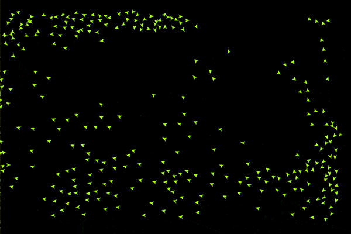

# boids
Implementation of the boids algo, with a pygame visualization.



### Instructions

Clone the repo, and install dependencies:

```
git clone https://github.com/FrancoisPgm/boids.git
cd boids
pip install -r requirements.txt
```

To run the simulation:
```
python3 main.py
```

You can quit the simulation by pressing the escape key.
You can reset the boids during the simulation by pressing the R key.

Some options can be changed with several flags :
```
python main.py --help
usage: main.py [-h] [--n_boids N_BOIDS] [--fps FPS] [--show_fps] [--fullscreen]
               [--width WIDTH] [--height HEIGHT]
               [--bg_col BG_COL BG_COL BG_COL] [--boid_col BOID_COL BOID_COL BOID_COL]
               [--speed SPEED]

optional arguments:
  -h, --help            show this help message and exit
  --n_boids N_BOIDS, -n N_BOIDS
                        Number of boids, default=150.
  --fps FPS             FPS, default=60.
  --show_fps            Show FPS.
  --fullscreen          Show in full screen.
  --width WIDTH         Window width, ignored if fullscreen, default=1200.
  --height HEIGHT       Window height, ignored if fullscreen, default=800.
  --bg_col BG_COL BG_COL BG_COL
                        Background color in RGB, default is balck.
  --boid_col BOID_COL BOID_COL BOID_COL
                        Color of boids in RGB, default is random.
  --speed SPEED, -s SPEED
                        Maximum speed, defult=15.
```

For example:
```
python main.py --show_fps --n_boids 200 --boid_col 195 195 95
```


### Credits:

Pygame visualization code based on https://github.com/Nikorasu/PyNBoids (Copyright (c) 2021  Nikolaus Stromberg - nikorasu85@gmail.com)

Boids rules based on https://github.com/beneater/boids (Copyright 2020 Ben Eater)
